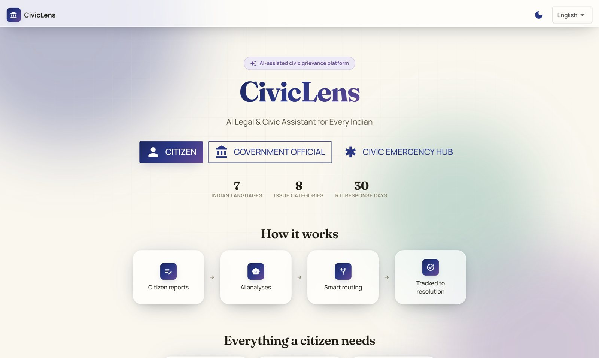
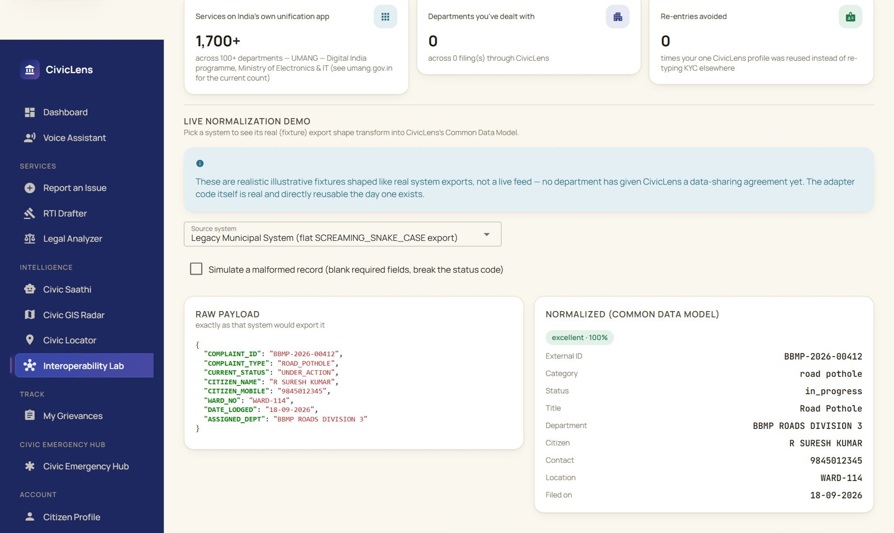
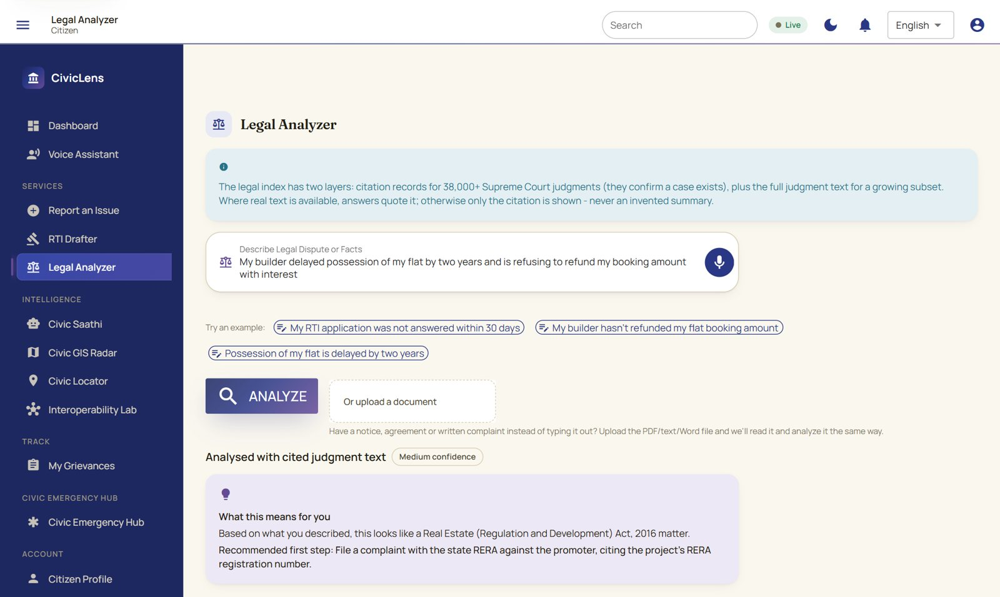
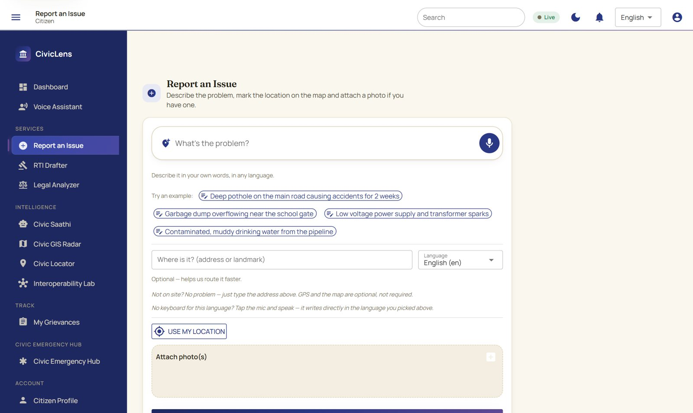
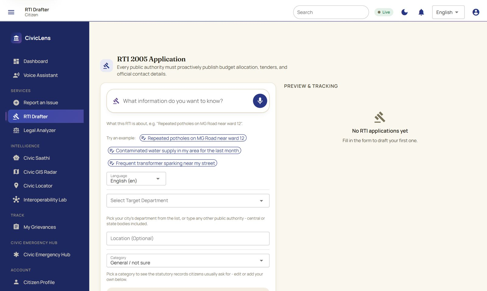
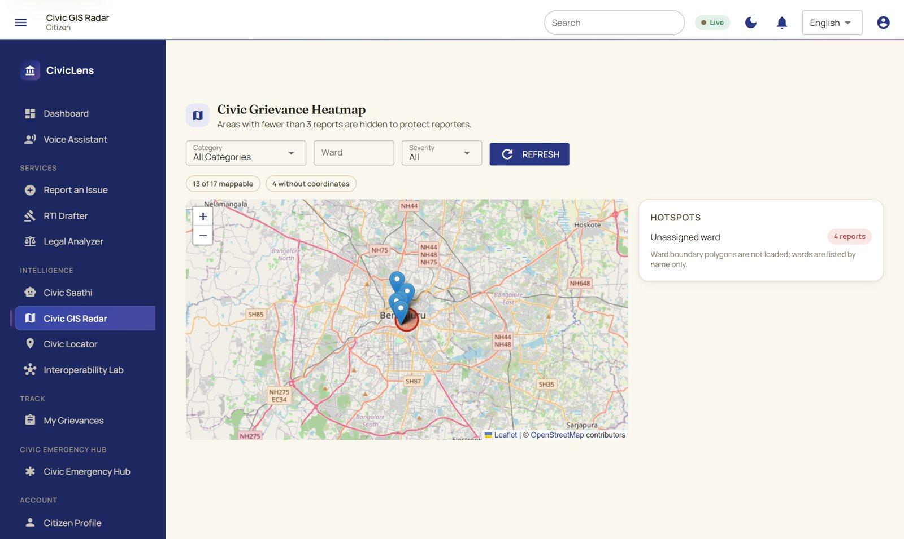
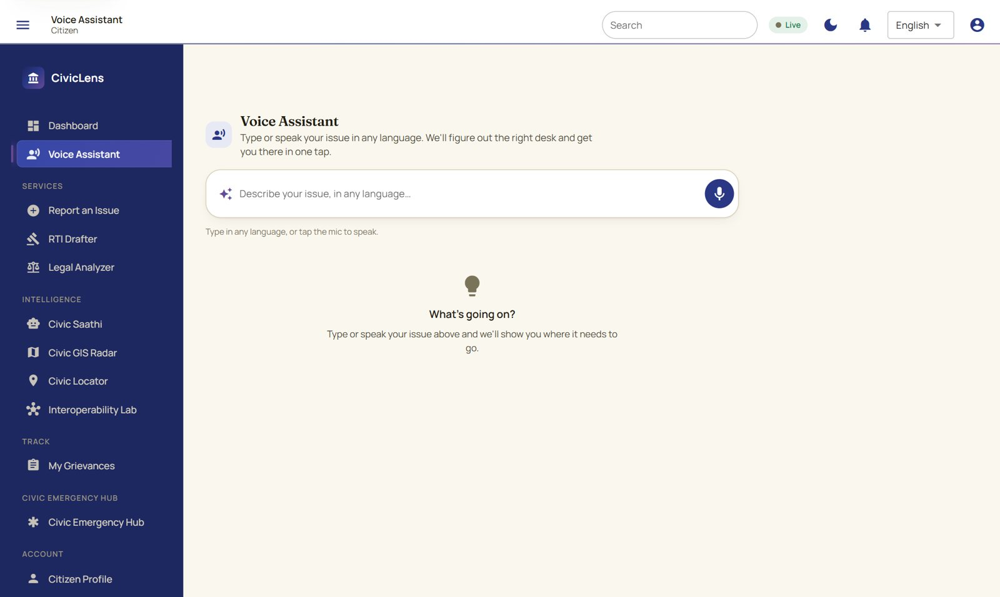
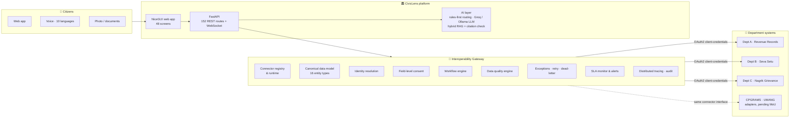
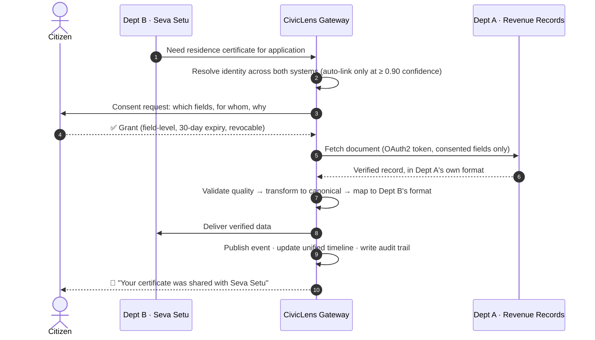

<div align="center">

# 🏛️ CivicLens

### One citizen. One consent click. Every department already knows.

**An interoperability gateway that lets Indian government departments securely reuse each other's verified data —<br/>plus the citizen app that sits on top of it: complaints, RTI, legal help and voice, in Indian languages.**

[](https://github.com/thirthpatel2-web/Civiclens/actions/workflows/ci.yml)


**Smart India Hackathon 2026 · Problem Statement SIH26129 · Theme: Miscellaneous · Team CODEXXA (Team ID 159997)**

[The problem](#-the-problem) · [The idea](#-the-idea-in-30-seconds) · [See it](#-see-it) · [How it works](#%EF%B8%8F-how-it-works) · [Run it](#-run-it-locally) · [What's real](#-whats-real-and-whats-a-demo) · [Docs](#-documentation-map)



</div>

---

## 😩 The problem

> **SIH26129 — System integration and interoperability among government digital platforms, resulting in fragmented service delivery.**

India has built hundreds of excellent digital services, but they were built **one department at a time**:

| What a citizen lives through today | Why it happens |
|---|---|
| Uploads the **same certificate** to every new portal | Department B can't read what Department A has already verified |
| Is `"R SURESH KUMAR"` in one system and `"Suresh Kumar R."` in another | No shared identity — every system invented its own IDs and formats |
| Has no idea where an application went after it left one office | Nothing traces a request once it crosses department lines |
| Never knows who looked at their data, or why | Data moves by email, file dumps and manual re-entry, with no consent record |
| Files a complaint that lands at the wrong office | Routing is manual and department-specific |

**The scale:** UMANG alone fronts **1,700+ services from 100+ departments**, Maharashtra's Aaple Sarkar offers **400+**, and API Setu lists **8,036 APIs from 10,530 organisations** (March 2026). The APIs exist. What's missing is the **governed, consent-first layer that lets them work together**. That layer is CivicLens.

---

## 💡 The idea in 30 seconds

```
   TODAY                                          WITH CIVICLENS
   ─────                                          ──────────────
   1. Visit the Revenue office                    1. Citizen clicks "I consent"
   2. Collect the residence certificate                  │
   3. Scan / photocopy it                                ▼
   4. Upload it to the Seva Setu portal           Gateway resolves identity → checks consent →
   5. Wait while an officer re-verifies it        fetches the verified record from Revenue →
                                                  validates quality → transforms to Seva Setu's
   5 steps · days · paper · zero traceability     format → delivers → traces every hop
                                                  1 click · seconds · paperless · fully audited
```

CivicLens is two things built as one platform:

1. **🔗 The Interoperability Gateway**: a standards-based middle layer. Every department keeps its own system untouched. CivicLens plugs into each one with a **connector**, translates everything into one **canonical data model**, and moves data between departments **only with the citizen's field-level consent**, with every step traced and audited.
2. **📱 The citizen front door**: file a complaint by text, **voice or photo**; get it **routed automatically** to the right office; draft an **RTI application** in minutes; ask the **AI legal analyzer**, which cites real Supreme Court judgments or says it doesn't know. Voice input and complaint understanding work in **10 Indian languages**, and the full interface is translated into **7**.

---

## 📸 See it

<table>
<tr>
<td width="50%"><br/><b>Interoperability Lab</b>: a legacy system's raw <code>SCREAMING_SNAKE_CASE</code> export, normalized live into the Common Data Model with a quality score.</td>
<td width="50%"><br/><b>Legal Analyzer</b>: plain-language answer, the right statute and forum, and precedents checked against 38,238 real Supreme Court judgment records.</td>
</tr>
<tr>
<td><br/><b>Report an Issue</b>: type or speak in your own language, pin the map, attach evidence. Category, department and priority are worked out automatically.</td>
<td><br/><b>RTI Drafter</b>: a Right to Information application in the correct statutory format, with department suggestions and a downloadable PDF.</td>
</tr>
<tr>
<td><br/><b>Civic GIS Radar</b>: complaint hotspots on a live OpenStreetMap map. Areas with fewer than 3 reports are hidden to protect reporters.</td>
<td><br/><b>Voice Assistant</b>: describe the problem in any language and get sent to the right desk in one tap.</td>
</tr>
</table>

---

## ⚙️ How it works

### The architecture



### The headline flow: "never upload the same document twice"

*Seva Setu (Dept B) needs a residence certificate that Revenue Records (Dept A) already holds and has already verified.*



Every hop shares one **correlation ID**, so an auditor can replay exactly what happened for any single exchange.

### Nine steps, each one a guarantee

| # | Step | What it guarantees |
|:-:|---|---|
| 1 | **Resolve identity** | Records are linked automatically only at **≥ 0.90** confidence. Between 0.55 and 0.90 the match goes to an **officer's review queue**, so two different citizens are never silently merged. |
| 2 | **Request consent** | The citizen approves **specific fields** for **one specific purpose**. Consent expires after 30 days and can be revoked at any time. |
| 3 | **Fetch document** | Connectors authenticate through a **federated OAuth2 IdP** (RFC 6749 client credentials). A disabled client is refused outright. |
| 4 | **Validate** | The **data quality engine** runs 8 rule types (required, regex, allowed values, freshness, cross-field equality…) and returns a score. |
| 5 | **Transform** | Department format → **canonical model** → target department's format, driven by the **field-mapping catalog**. |
| 6 | **Deliver** | Idempotent: running the same exchange twice never duplicates data. |
| 7 | **Publish event** | Goes onto the **Redis Streams** event bus. Subscribers get only a minimal payload, never raw rows. |
| 8 | **Update tracker** | A **unified cross-department timeline** for the application. |
| 9 | **Notify** | The citizen is told what was shared, with whom, and when. |

When something fails, it fails **loudly and honestly**: a **20-code exception taxonomy**, automatic retry and a **dead-letter queue**, **SLA thresholds** (default 1000 ms / 95%) that raise alerts, and a trace for every transaction.

---

## ✨ What makes it different

| | |
|---|---|
| 🛡️ **Consent-first, not consent-after** | Consent is checked **before** any connector is called, per field and per purpose, in line with the DPDP Act 2023. Asking for more than was consented is refused with the exact denied field names. |
| 🧬 **Never a silent merge** | Ambiguous identity matches always go to a human, and a rejected match creates a separate identity attributed to that officer. |
| 🔌 **Add a department in hours, not months** | A new system is **one connector class + one registry line + its field mappings**. The gateway code doesn't change. The connector interface is transport-agnostic, so a real department API replaces a demo one by swapping only its query functions. |
| ⚖️ **AI that won't make up law** | Every case the AI cites is checked against **38,238 real Supreme Court citation records**. If a citation can't be verified, the AI explanation is **withheld**, not shown. Where the full text of a judgment is available (292 judgments, 9,869 searchable passages), answers quote it. |
| 🗣️ **Voice-first, native-script** | A Kannada speaker gets Kannada text back. Nothing is silently translated to English, and translation, when used, is a separate, clearly labelled field. |
| 🔍 **Explainable by design** | Every legal answer has a **"Why this result"** tab showing each step taken, what matched, and what couldn't be verified. |

---

## 🧰 Tech stack

| Layer | Technology |
|---|---|
| **Backend & API** | Python 3.12 · FastAPI · Pydantic · SQLAlchemy 2 · Alembic (16 migrations) |
| **Web app** | NiceGUI (Vue/Quasar under the hood) · Leaflet + OpenStreetMap · WebSockets for live updates |
| **Data & messaging** | PostgreSQL + pgvector · Redis (Streams event bus, rate limiting, job queue) |
| **AI / NLP** | Groq-hosted LLM or local Ollama · hybrid RAG (BM25 + vectors + reciprocal-rank fusion + rerank) · rules-first complaint classifier |
| **Voice & documents** | Groq Whisper / faster-whisper / Bhashini speech-to-text · Tesseract OCR · ReportLab PDF generation |
| **Interop & security** | OAuth2 (RFC 6749) federated IdP · Argon2 password hashing · RBAC with 6 roles · CSRF protection · audit log · Sentry |
| **Quality** | pytest (727 tests) · ruff · mypy · GitHub Actions CI · Docker Compose |

---

## 🚀 Run it locally

**You need:** Python 3.12+ and PostgreSQL with the `pgvector` extension. Redis and an LLM are optional: without them the app keeps working and says clearly which features are unavailable.

```bash
git clone https://github.com/thirthpatel2-web/Civiclens.git && cd Civiclens
python -m venv .venv
.venv\Scripts\activate                     # Windows   (macOS/Linux: source .venv/bin/activate)
pip install -r requirements-dev.txt

cp .env.example .env                       # then set DATABASE_URL, APP_SECRET_KEY, EMBEDDING_DIMENSIONS
                                           # optional: GROQ_API_KEY for AI answers + voice
createdb civiclens && psql civiclens -c "CREATE EXTENSION vector"
alembic upgrade head                       # builds the whole schema
python scripts/seed.py                     # departments, cities, routing rules, emergency contacts

python run.py                              # 👉 open http://localhost:8080
```

Register as a citizen in the app, or create the first admin with `scripts/create_admin.py`. The demo departments and connectors are seeded automatically on first start. `docs/DEMO_GUIDE.md` walks through the whole cross-department exchange, call by call.

<details>
<summary><b>🐳 Prefer Docker?</b></summary>

```bash
cp .env.example .env          # at minimum set APP_SECRET_KEY and EMBEDDING_DIMENSIONS
docker compose up -d --build
docker compose exec ollama ollama pull llama3.1:8b
docker compose exec ollama ollama pull nomic-embed-text
```

This brings up Postgres + pgvector, Redis, Ollama, a one-shot migration service, the app on `:8080` and the background worker. The compose setup is statically checked, but we haven't run a full `docker compose up --build` end to end, so treat the plain-Python path above as the primary one.
</details>

<details>
<summary><b>🧪 Verify it yourself</b></summary>

```bash
python -m pytest -q                      # 727 tests: unit, API, live-database integration, end-to-end
ruff check app scripts tests             # lint
mypy app                                 # static types
python scripts/audit_ui_links.py         # every navigation target exists
python scripts/audit_imports.py          # no broken imports or cycles
```

The same checks run on every push in [GitHub Actions](https://github.com/thirthpatel2-web/Civiclens/actions).
</details>

---

## 📊 By the numbers

<div align="center">

| 727 | 31 / 34 | 31 / 31 | 38,238 | 10 | 48 | 152 |
|:-:|:-:|:-:|:-:|:-:|:-:|:-:|
| automated tests passing | SIH26129 spec capabilities done | live end-to-end checks passed | Supreme Court judgment records | languages for voice & complaints | web screens | REST API routes |

</div>

The spec count comes from [`docs/REQUIREMENT_TRACEABILITY.md`](docs/REQUIREMENT_TRACEABILITY.md). Every row names its code, API, database model, screen and test. Of 34 capabilities: **31 done** (25 fully, 6 with a narrower part named explicitly), **2 partial**, **1 not started**. Nothing is marked done unless it runs, is tested, and can be demonstrated.

---

## 🧾 What's real and what's a demo

We think judges should know exactly what they're looking at, so here it is plainly:

| ✅ Real and working | 🧪 Demo / simulated |
|---|---|
| Gateway engine: consent, identity resolution, workflow, quality, exceptions, SLA, tracing, audit | The **three department systems** (Revenue Records, Seva Setu, Nagrik Grievance) are **realistic mock systems** with their own schemas. No department has signed a data-sharing agreement with us yet. |
| OAuth2 client-credentials flow between gateway and connectors | The **identity provider** is our own mock federated IdP, clearly labelled *DEMO / MOCK* in every response |
| Complaint intake, AI routing, RTI drafting, legal analysis, GIS, notifications | **CPGRAMS / UMANG** adapters: the orchestration, consent gate and state machine are built, but with no credentials configured **nothing is ever sent** |
| 38,238 Supreme Court citation records + 292 full-text judgments | |
| Live Groq LLM + Whisper speech-to-text, local Ollama embeddings | |

**Going live means swapping a connector's query functions for real API calls. The gateway, consent, audit and every guarantee above stay exactly as they are.**

---

## 🔐 Security & privacy

- **Consent-gated data exchange**, per field and per purpose, expiring and revocable, in line with the **DPDP Act 2023** ([checklist](docs/DPDP_COMPLIANCE_CHECKLIST.md)).
- **Least-privilege RBAC** with 6 roles. `AUDITOR` is read-only by construction, and only a super-admin can grant integration roles.
- **Argon2** password hashing, server-side sessions that are revoked on logout or password change, **CSRF** protection, login throttling with no user enumeration.
- **Complete audit trail** plus correlation-ID tracing on every exchange. Event payloads are minimized and never raw database rows.
- **Upload validation, SSRF guard and prompt-injection defences** on everything that reaches the AI.
- No secrets in the repository: `.env` is git-ignored, and only `.env.example` with empty values is committed.

Full detail: [`docs/SECURITY.md`](docs/SECURITY.md) · To report a vulnerability: [`SECURITY.md`](SECURITY.md)

---

## 🗺️ Documentation map

| Document | What's inside |
|---|---|
| [`docs/INTEROPERABILITY.md`](docs/INTEROPERABILITY.md) | The gateway design end to end: consent state machine, identity resolution, federation, events |
| [`docs/ARCHITECTURE_DIAGRAMS.md`](docs/ARCHITECTURE_DIAGRAMS.md) | 10 architecture diagrams |
| [`docs/REQUIREMENT_TRACEABILITY.md`](docs/REQUIREMENT_TRACEABILITY.md) | 34-row map from the SIH26129 spec to code, API, model, UI and test |
| [`docs/DEMO_GUIDE.md`](docs/DEMO_GUIDE.md) | Copy-paste walkthrough of the no-reupload exchange |
| [`docs/CONNECTOR_GUIDE.md`](docs/CONNECTOR_GUIDE.md) | How to plug in a new department system |
| [`docs/WORKFLOW_GUIDE.md`](docs/WORKFLOW_GUIDE.md) | Defining multi-step workflows as data |
| [`docs/DATA_MODEL.md`](docs/DATA_MODEL.md) | The canonical data model |
| [`docs/API_CONTRACT.md`](docs/API_CONTRACT.md) | REST API reference |
| [`docs/SECURITY.md`](docs/SECURITY.md) · [`docs/DPDP_COMPLIANCE_CHECKLIST.md`](docs/DPDP_COMPLIANCE_CHECKLIST.md) | Security model and DPDP Act mapping |
| [`ARCHITECTURE.md`](ARCHITECTURE.md) · [`FEATURE_MATRIX.md`](FEATURE_MATRIX.md) | Whole-platform architecture and feature list |
| [`THIRD_PARTY_DATA.md`](THIRD_PARTY_DATA.md) | Licence and attribution for the judgment data |

<details>
<summary><b>📁 Repository layout</b></summary>

```
app/
├── interop/          🔗 the gateway: canonical model, connectors, federation, identity,
│                        workflow, quality, exceptions, monitoring, events, catalogs
├── services/         business logic (complaints, RTI, legal, consent, notifications…)
├── api/v1/           FastAPI routes
├── ui/               NiceGUI web app (48 screens, no hand-written JavaScript)
├── rag/ · legal/     retrieval pipeline and legal analysis
├── providers/        speech-to-text, OCR, vision, push
├── i18n/             languages and translated UI strings
├── db/               models, repositories, unit of work
└── workers/          background jobs and scheduler
alembic/              database migrations
tests/                727 tests: unit, API, integration (live DB), end-to-end
docs/                 everything in the table above
classic-app/          earlier React Native (Expo) client of the same API, kept for reference
```
</details>

---

## 🙏 Built on the shoulders of

API Setu · National Data Governance Framework · UMANG · DigiLocker · Aaple Sarkar · CPGRAMS · Bhashini · the Indian Supreme Court judgments dataset ([vanga/indian-supreme-court-judgments](https://github.com/vanga/indian-supreme-court-judgments), CC-BY-4.0) · OpenStreetMap contributors · and every open-source project in the stack above.

<div align="center">

**Team CODEXXA** · Smart India Hackathon 2026

*CivicLens's own code is MIT-licensed ([`LICENSE`](LICENSE)). The judgment data carries its own licence: see [`THIRD_PARTY_DATA.md`](THIRD_PARTY_DATA.md).*

</div>
