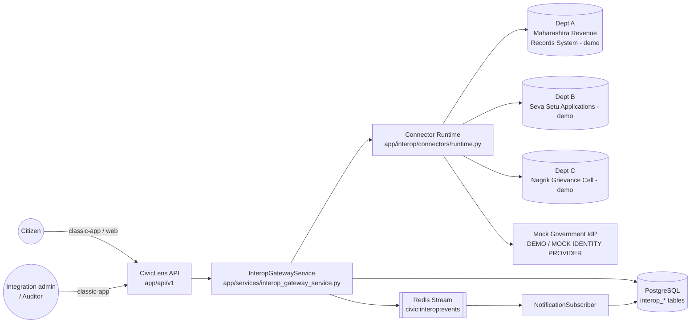
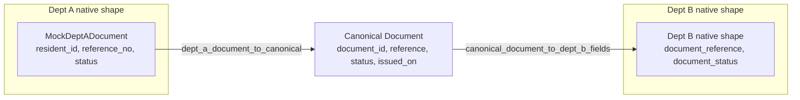
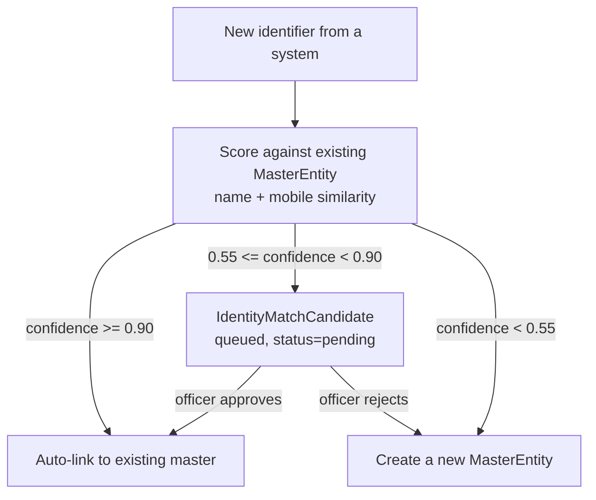
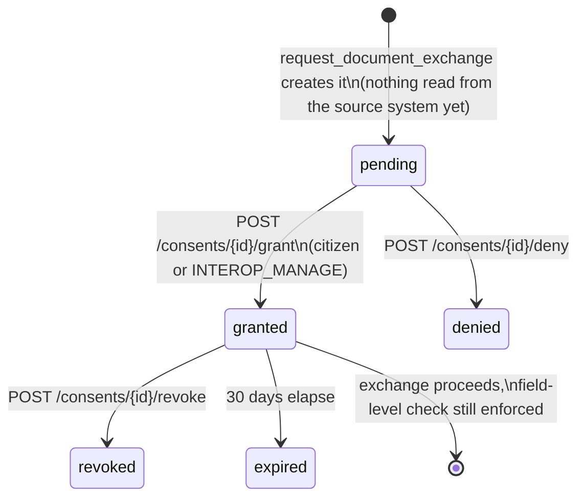
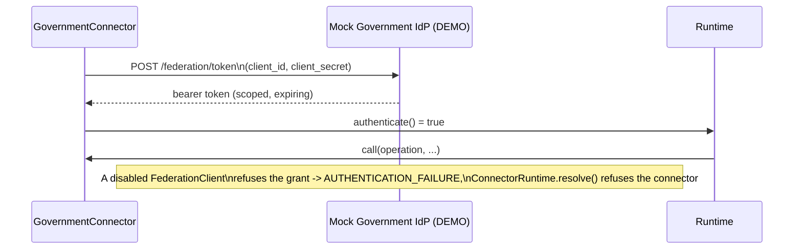
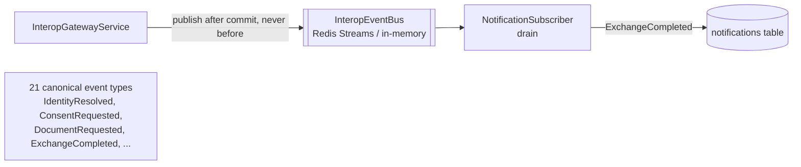
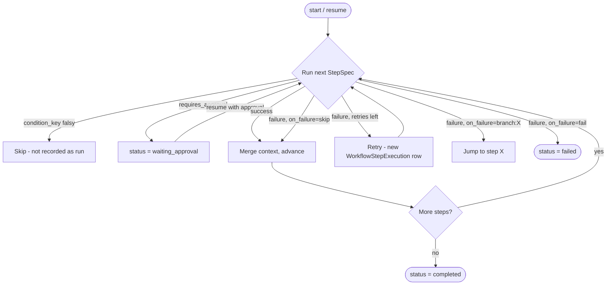
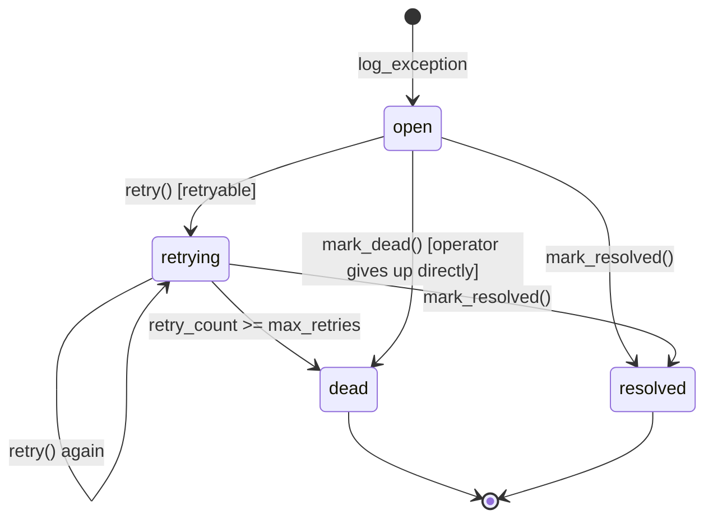
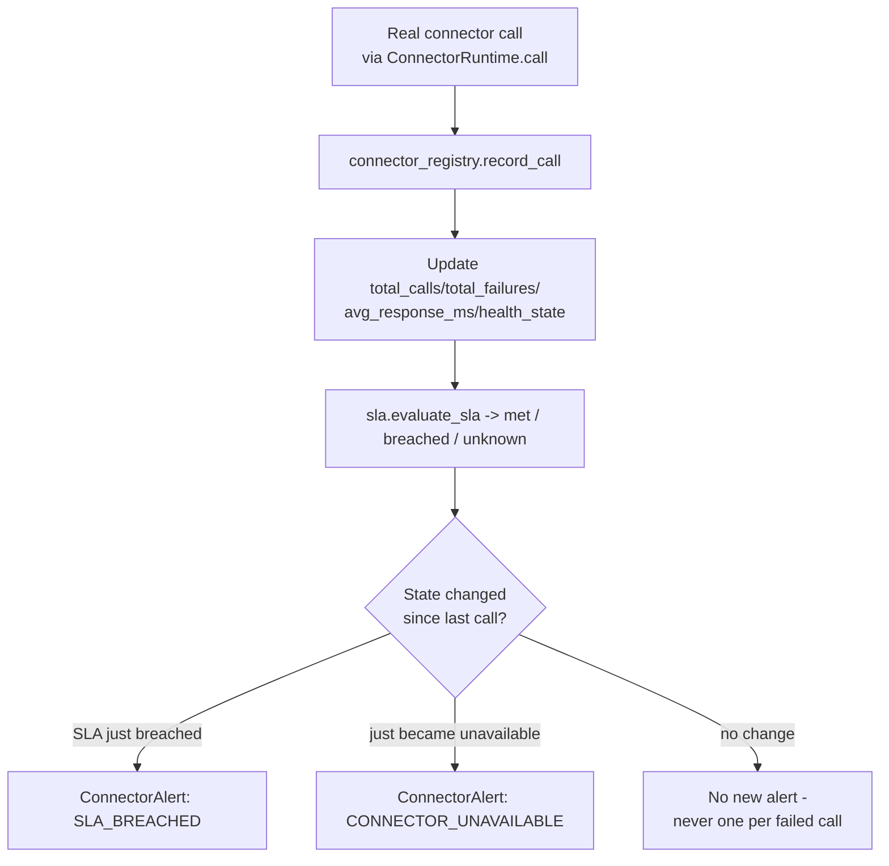
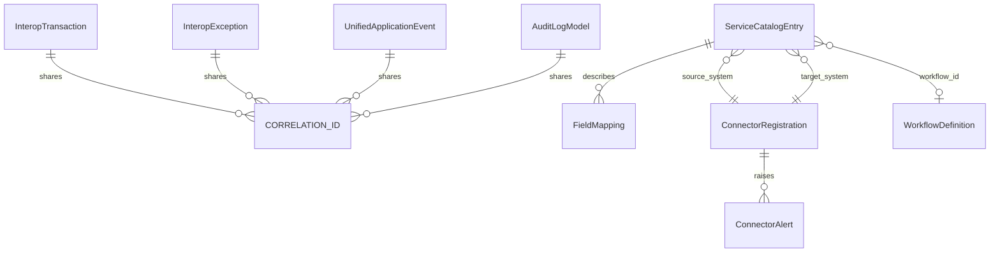

# Architecture diagrams — interoperability platform

Ten diagrams covering the interop platform built across Phases 1-9. Mermaid, so they render
inline on GitHub and most Markdown viewers — no separate image files to keep in sync with the code
they describe. Each one names the real file(s) it corresponds to; none of these are aspirational —
every box and arrow here is something that exists and is tested. See `docs/INTEROPERABILITY.md`
for the prose explanation each diagram accompanies.

## 1. System context



## 2. Canonical data model & connector abstraction (Section 1)

`app/interop/canonical/v1/transform.py`, `app/interop/connectors/`



## 3. Identity resolution / MDM (Section 3-4)

`app/interop/identity_resolution.py`



## 4. Consent lifecycle (Section 7-8)

`InteropConsentGrant`, `InteropGatewayService`



## 5. Federated identity — DEMO / MOCK IDENTITY PROVIDER (Section 6)

`app/interop/federation/idp.py` — OAuth2 `client_credentials` (RFC 6749 §4.4)



## 6. Event-driven pub/sub (Section 10-11)

`app/interop/events/`



## 7. Configurable workflow engine (Section 12-13)

`app/interop/workflow/engine.py`



## 8. Data quality engine & central exception management (Section 14-18)

`app/interop/quality/engine.py`, `app/interop/exceptions/`

```mermaid
flowchart LR
    Record[Any record - a dict] --> Engine[DataQualityEngine.evaluate]
    Rules[QualityRule list\nrequired/min_length/max_length/\nregex/in_set/not_in_future/\nstale_after_days/cross_field_equals] --> Engine
    Engine --> Result{status}
    Result -->|VALID| Pass[Proceed]
    Result -->|VALID_WITH_WARNINGS| PassWarn[Proceed, warnings logged]
    Result -->|REJECTED| Log[exceptions.center.log_exception\nclassify() -> canonical taxonomy code]
    Log --> Exc[(InteropException\nresolution_state)]
```



## 9. Connector SLA & alerting (Section 19-20)

`app/interop/monitoring/`



## 10. Distributed transaction tracing & the interop schema (Section 21-23)

`InteropGatewayService.get_trace`



`correlation_id_var` (`app/core/logging.py`) is set once per gateway call and threads through every
row above without any per-table plumbing added for tracing itself — `GET /trace/{correlation_id}`
is a read over data that already existed before Phase 7.
